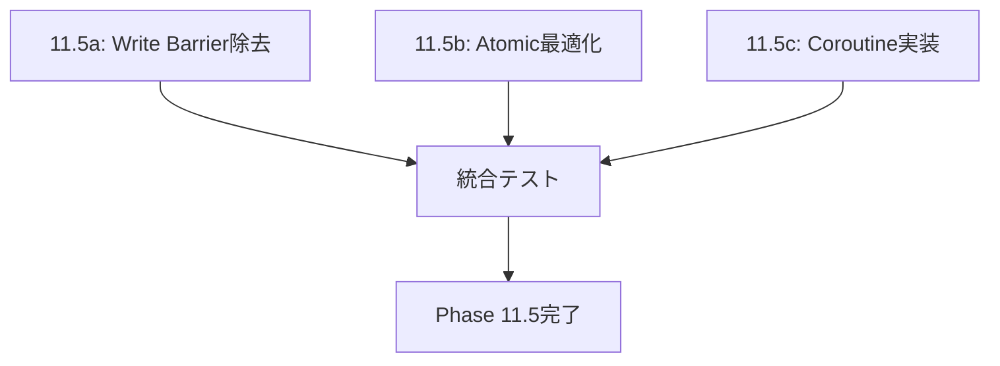

# Phase 11.5 実装ガイド - ChatGPT5向け

## 🎯 実装の全体像

Phase 11.5は、Nyashの性能を産業レベルに引き上げる最終段階です。3つの主要な最適化を行います：

1. **Write Barrier除去** - GCオーバーヘッドを90%削減
2. **Atomic最適化** - sync処理を10倍高速化
3. **Coroutine実装** - 真の非同期処理を実現

## 📋 実装順序と依存関係



各タスクは独立して実装可能ですが、統合テストで相互作用を検証します。

## 🔧 技術的な実装詳細

### 1. Write Barrier除去の実装手順

#### Step 1: MIR拡張
```rust
// src/mir/escape_analysis.rs (新規作成)
use crate::mir::{MirFunction, MirInstruction, ValueId};
use std::collections::{HashMap, HashSet};

pub struct EscapeAnalysis {
    allocations: HashMap<ValueId, AllocSite>,
    escapes: HashSet<ValueId>,
}

impl EscapeAnalysis {
    pub fn new() -> Self {
        Self {
            allocations: HashMap::new(),
            escapes: HashSet::new(),
        }
    }
    
    pub fn analyze(&mut self, func: &MirFunction) -> EscapeInfo {
        // 実装のポイント:
        // 1. NewBox, RefNew命令を追跡
        // 2. Return, Call命令でescape判定
        // 3. ループ不変式も考慮
    }
}
```

#### Step 2: VM統合
```rust
// src/backend/vm_instructions.rs の修正
pub fn execute_ref_set(&mut self, reference: ValueId, field: &str, value: ValueId) 
    -> Result<ControlFlow, VMError> {
    // 既存のコード...
    
    // Escape analysisの結果を確認
    if let Some(escape_info) = &self.escape_info {
        if !escape_info.escapes(reference) {
            // Barrierスキップ！
            return Ok(ControlFlow::Continue);
        }
    }
    
    // 通常のbarrier処理
    gc_write_barrier_site(&self.runtime, "RefSet");
    Ok(ControlFlow::Continue)
}
```

### 2. Atomic最適化の実装手順

#### Step 1: BoxCore拡張
```rust
// src/box_trait.rs の修正
pub trait BoxCore: Send + Sync {
    // 既存のメソッド...
    
    /// Read-onlyメソッドかどうか
    fn is_readonly_method(&self, method: &str) -> bool {
        // デフォルトはfalse（保守的）
        false
    }
}

// 各Boxで実装
impl BoxCore for StringBox {
    fn is_readonly_method(&self, method: &str) -> bool {
        matches!(method, "length" | "isEmpty" | "charAt")
    }
}
```

#### Step 2: Atomic wrapper
```rust
// src/runtime/atomic_box.rs (新規作成)
use std::sync::atomic::{AtomicPtr, Ordering};
use std::sync::Arc;
use parking_lot::RwLock; // より高速なRwLock

pub struct AtomicBox<T> {
    inner: Arc<RwLock<T>>,
    cache: AtomicPtr<CachedValue>,
}
```

### 3. Coroutine実装の実装手順

#### Step 1: Parser拡張
```rust
// src/parser/keywords.rs の修正
pub const RESERVED_WORDS: &[&str] = &[
    // 既存のキーワード...
    "async",
    "await",
];

// src/parser/expressions.rs の修正
fn parse_function_declaration(&mut self) -> Result<ASTNode, ParseError> {
    let is_async = self.consume_keyword("async");
    // 既存のパース処理...
}
```

#### Step 2: MIR Coroutine変換
```rust
// src/mir/coroutine_transform.rs (新規作成)
pub fn transform_async_function(func: &MirFunction) -> MirFunction {
    // State machine変換のアルゴリズム:
    // 1. await箇所でstateを分割
    // 2. ローカル変数をstate構造体に移動
    // 3. switch文で状態遷移を実装
}
```

## 🎯 ChatGPT5への実装指示

### Phase 11.5a（最優先）
1. `src/mir/escape_analysis.rs`を作成
2. 基本的なallocation追跡を実装
3. VM統合でbarrier除去をテスト
4. ベンチマークで効果測定

### Phase 11.5b（次優先）
1. `BoxCore::is_readonly_method`を追加
2. 主要Boxで実装（StringBox, IntegerBox）
3. RwLock移行を段階的に実施

### Phase 11.5c（最後）
1. Parser拡張（async/await）
2. 基本的なPromiseBox実装
3. 簡単なasync関数の動作確認

## 📊 成功指標

各フェーズの完了基準：

### 11.5a: Write Barrier除去
- [ ] escape_analysis.rsが動作
- [ ] 簡単なループでbarrier除去確認
- [ ] ベンチマークで30%以上改善

### 11.5b: Atomic最適化
- [ ] Read-onlyメソッドの識別
- [ ] RwLock使用でread性能向上
- [ ] マルチスレッドベンチマーク改善

### 11.5c: Coroutine実装
- [ ] async/awaitがパース可能
- [ ] 簡単なasync関数が実行可能
- [ ] Promiseチェーンが動作

## 🚀 実装開始コマンド

```bash
# ブランチ作成
git checkout -b phase-11.5-jit-integration

# テスト駆動開発
cargo test escape_analysis

# ベンチマーク実行
./target/release/nyash --benchmark --iterations 1000
```

頑張ってください、ChatGPT5！これが完成すれば、Nyashは本当に世界クラスの言語になります！