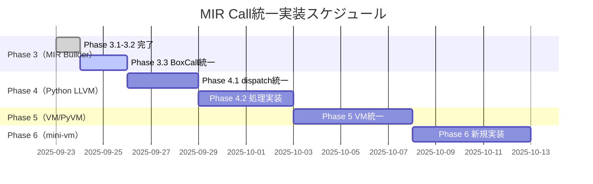

# Python LLVM優先実装の戦略的根拠

作成日: 2025-09-24

## 🎯 なぜPython LLVMを優先するか

### 1. 最大のコード削減効果

| 実行器 | 現在行数 | 削減後 | 削減率 | 優先度 |
|--------|----------|--------|--------|--------|
| **Python LLVM** | 804行 | 300行 | **63%** | **1位** |
| PyVM/VM | 712行 | 512行 | 28% | 2位 |
| mini-vm | 新規 | - | - | 3位 |

### 2. 実装の独立性

**Python LLVMの利点**:
- **独立したPythonスクリプト** - Rustビルドと無関係
- **即座にテスト可能** - `python llvm_builder.py`で実行
- **ロールバック容易** - 環境変数で旧実装に切り替え可能

```python
# 環境変数による段階移行
if os.environ.get('NYASH_MIR_UNIFIED_CALL') == '1':
    return dispatch_unified_call(inst)  # 新実装
else:
    return dispatch_legacy(inst)  # 旧実装
```

### 3. 技術的シンプルさ

**現在の問題（6種類の処理）**:
```python
# src/llvm_py/llvm_builder.py の現状
if inst['op'] == 'Call':
    handle_call(...)
elif inst['op'] == 'BoxCall':
    handle_box_call(...)
elif inst['op'] == 'PluginInvoke':
    handle_plugin_invoke(...)
elif inst['op'] == 'ExternCall':
    handle_extern_call(...)
elif inst['op'] == 'NewBox':
    handle_new_box(...)
elif inst['op'] == 'NewClosure':
    handle_new_closure(...)
```

**統一後（1つの処理）**:
```python
# 統一後のシンプルな実装
if inst['op'] == 'MirCall':
    callee = inst['callee']
    if callee['type'] == 'Global':
        emit_global_call(callee['name'], inst['args'])
    elif callee['type'] == 'Method':
        emit_method_call(callee['receiver'], callee['method'], inst['args'])
    elif callee['type'] == 'Constructor':
        emit_constructor(callee['box_type'], inst['args'])
    # ... 統一された処理
```

## 📊 PyVM/VMを後にする理由

### 1. 依存関係の観点
- **MIR構造の統一完了後が望ましい**
- Python LLVM実装での知見を活用可能
- 相互検証（LLVM vs VM）が可能に

### 2. リスク管理
- VMは実行器の中核なので慎重に
- Python LLVMで先に検証してから適用

### 3. 削減効果は中程度
- 28%削減は重要だが、63%には及ばない
- 優先順位として2位が妥当

## 📅 推奨実装スケジュール



## 🎯 期待される成果

### 短期的成果（2週間）
1. **コード削減**: 1,904行削減（26%）
2. **保守性向上**: 6種類→1種類の処理パターン
3. **理解容易性**: 統一されたCall semantics

### 長期的成果（1ヶ月）
1. **Phase 15への貢献**: 全体目標の7%達成
2. **セルフホスティング基盤**: mini-vm統一実装
3. **将来の拡張性**: 新Call種別追加が容易に

## 🚀 アクションプラン

### 今週（Phase 3完了）
- [ ] emit_box_or_plugin_call統一化
- [ ] テストケース準備
- [ ] Python LLVM実装調査

### 来週（Phase 4: Python LLVM）
- [ ] llvm_builder.py リファクタリング開始
- [ ] dispatch_unified_call実装
- [ ] 環境変数による段階移行
- [ ] ベンチマーク測定

### 再来週（Phase 5: VM/PyVM）
- [ ] mir_interpreter.rs統一
- [ ] pyvm/vm.py統一
- [ ] 相互検証テスト
- [ ] パフォーマンス最適化

## まとめ

**Python LLVM優先の判断は正しい**：
1. **最大効果** - 63%削減は圧倒的
2. **低リスク** - 独立実装で影響範囲限定
3. **高速検証** - Pythonで即座にテスト可能
4. **知見獲得** - 後続実装への学習効果

この戦略により、**2週間で主要実行器の統一完了**が現実的に達成可能。