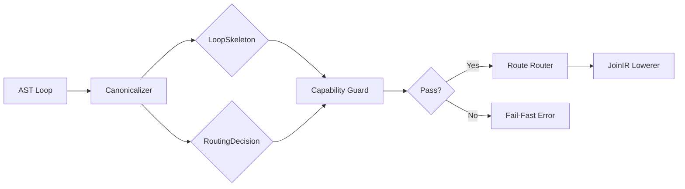
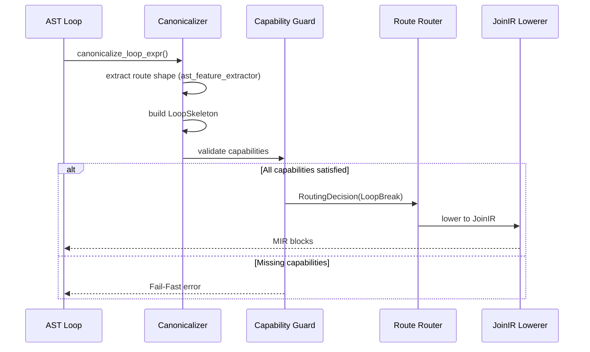

# Loop Canonicalizer（設計 SSOT）

Status: Phase 141 完了（ドキュメント充実）
Scope: ループ形の組み合わせ爆発を抑えるための "前処理" の設計（fixture/shape guard/fail-fast と整合）
Related:
- SSOT (契約/不変条件): `docs/development/current/main/joinir-architecture-overview.md`
- SSOT (地図/入口): `docs/development/current/main/design/joinir-design-map.md`
- SSOT (ルート空間 / legacy pattern space): `docs/development/current/main/loop_pattern_space.md`

## アーキテクチャ図

### データフロー



### モジュール構成

```
loop_canonicalizer/
├── skeleton_types.rs      [Data Structures]
│   ├── LoopSkeleton
│   ├── SkeletonStep
│   ├── UpdateKind
│   └── CarrierSlot
├── capability_guard.rs    [Validation]
│   ├── RoutingDecision
│   ├── CapabilityTag (enum)
│   └── Decision constructors
├── pattern_recognizer.rs  [Route Candidate Detection]
│   └── detect route candidates (ast_feature_extractor 呼び出し)
└── canonicalizer.rs       [Main Logic]
    └── canonicalize_loop_expr()
         ↓
    LoopSkeleton + RoutingDecision
         ↓
    Route Router (patterns/router.rs)
         ↓
    Route Lowerer (semantic route modules)
```

### 処理フロー（Phase 140 完了後）



## 目的

- 実アプリ由来のループ形を、fixture + shape guard + Fail-Fast の段階投入で飲み込む方針を維持したまま、  
  “パターン数を増やさない” 形でスケールさせる。
- ループ lowerer が「検出 + 正規化 + merge 契約」を同時に背負って肥大化するのを防ぎ、責務を前処理に寄せる。

## 推奨配置（結論）

**おすすめ**: `AST → LoopSkeleton → JoinIR(Structured)` の前処理として Canonicalizer を置く。

- 「組み合わせ爆発」が route candidate 検出/shape guard の手前で起きるため、Normalized 変換だけでは吸収しきれない。
- LoopSkeleton を SSOT にすると、lowerer は “骨格を吐く” だけの薄い箱になり、Fail-Fast の理由が明確になる。

代替案（参考）:
- `Structured JoinIR → Normalized JoinIR` を実質 Canonicalizer とみなす（既存延長）。  
  ただし「検出/整理の肥大」は Structured 生成側に残りやすい。

## LoopSkeleton（SSOT になる出力）

Canonicalizer の出力は “ループの骨格” に限る。例示フィールド:

- `steps: Vec<Step>`
  - `HeaderCond`（あれば）
  - `BodyInit`（body-local 初期化を分離するなら）
  - `BreakCheck` / `ContinueCheck`（あれば）
  - `Updates`（carrier 更新規則）
  - `Tail`（継続呼び出し/次ステップ）
- `carriers: Vec<CarrierSlot>`（loop var を含む。役割/更新規則/境界通過の契約）
- `exits: ExitContract`（break/continue/return の有無と payload）
- `captured: Vec<CapturedSlot>`（外側変数の取り込み）
- `derived: Vec<DerivedSlot>`（digit_pos 等の派生値）

## Capability Guard（shape guard の上位化）

Skeleton を生成できても、lower/merge 契約が成立するとは限らない。  
そこで `SkeletonGuard` を “Capability の集合” として設計する。

例:
- `RequiresConstStepIncrement`（i=i+const のみ）
- `BreakOnlyOnce` / `ContinueOnlyInTail`
- `NoSideEffectInHeader`（header に副作用がない）
- `ExitBindingsComplete`（境界へ渡す値が過不足ない）

未達の場合は Fail-Fast（理由を `RoutingDecision` に載せる）。

## RoutingDecision（理由の SSOT）

Canonicalizer は "できない理由" を機械的に返す。

- `RoutingDecision { chosen, missing_caps, notes, error_tags }`
- `missing_caps` は定型の語彙で出す（ログ/デバッグ/統計で集約可能にする）

## Capability Tags 対応表

### 各 Tag の詳細

| Tag | 必要な条件 | 対応route | 検出方法 |
|-----|----------|------------|---------|
| `ConstStep` | キャリア更新が定数ステップ（`i = i + const`） | LoopSimpleWhile / LoopBreak / IfPhiJoin | UpdateKind 分析（ConstStep variant） |
| `SingleBreak` | break 文が単一箇所のみ | LoopBreak | AST 走査でカウント（`count_break_checks() == 1`） |
| `SingleContinue` | continue 文が単一箇所のみ | LoopSimpleWhile / IfPhiJoin | AST 走査でカウント（`count_continue_checks() == 1`） |
| `PureHeader` | ループ条件に副作用がない | LoopSimpleWhile / LoopBreak / IfPhiJoin / LoopContinueOnly | 副作用解析（将来実装） |
| `OuterLocalCond` | 条件変数が外側スコープで定義済み | IfPhiJoin | Scope 分析（BindingContext 参照） |
| `ExitBindings` | 境界へ渡す値が過不足ない | LoopBreak / IfPhiJoin | Carrier 収支計算（ExitContract 分析） |
| `CarrierPromotion` | LoopBodyLocal を昇格可能 | IfPhiJoin / LoopContinueOnly | Binding 解析（promoted carriers 検出） |
| `BreakValueType` | break 値の型が一貫 | LoopBreak | 型推論（TypeContext 参照） |

### 各 route family の必須 Capability（Phase 140 時点）

#### LoopSimpleWhile family (legacy label: Pattern1)
- ✅ `ConstStep` - 定数ステップ増分
- ✅ `PureHeader` - 副作用なし条件
- ✅ `SingleContinue` - continue 単一箇所

#### LoopBreak family (legacy label: Pattern2)
- ✅ `ConstStep` - 定数ステップ増分
- ✅ `PureHeader` - 副作用なし条件
- ✅ `SingleBreak` - break 単一箇所
- ✅ `ExitBindings` - 出口値の完全性

**例**: `skip_whitespace` は `has_break=true` なので LoopBreak family へルーティング（legacy label: Pattern2, Phase 137-5）

#### IfPhiJoin route (legacy label: Pattern3)
- ✅ `ConstStep` - 定数ステップ増分
- ✅ `PureHeader` - 副作用なし条件
- ✅ `OuterLocalCond` - 外側スコープ条件変数
- ✅ `CarrierPromotion` - LoopBodyLocal 昇格

**例**: Trim パターン（Phase 133）

#### LoopContinueOnly route (legacy label: Pattern4)
- ✅ `PureHeader` - 副作用なし条件
- ✅ `CarrierPromotion` - LoopBodyLocal 昇格
- ✅ `ExitBindings` - 出口値の完全性

#### LoopTrueEarlyExit family (legacy label: Pattern5, future)
- 🚧 TBD - 将来定義

### Capability 追加時のチェックリスト

新しい Capability を追加する際は以下を確認：

1. **enum 定義**: `capability_guard.rs` の `CapabilityTag` に variant 追加
2. **文字列変換**: `to_tag()` メソッドに対応を追加（`CAP_MISSING_*` 形式）
3. **説明文**: `description()` メソッドに説明を追加
4. **検出ロジック**: `canonicalizer.rs` に検出ロジックを実装
5. **対応表更新**: このドキュメントの対応表を更新
6. **Route 更新**: 必要に応じて各 route の必須 Capability リストを更新
7. **テスト追加**: 新 Capability の検出テストを追加

## Corpus / Signature（拡張のための仕組み）

将来の規模増加に備え、ループ形の差分検知を Skeleton ベースで行えるようにする。

- `LoopSkeletonSignature = hash(steps + exit_contract + carrier_roles + required_caps)`
- 既知集合との差分が出たら “fixture 化候補” として扱う（設計上の導線）。

## 実装の境界（非目標）

- 新しい言語仕様/ルール実装はしない（既存の意味論を保つ）。
- 非 JoinIR への退避（prohibited fallback）は導入しない。
- 既定挙動は変えない（必要なら dev-only で段階投入する）。

## LoopSkeleton の最小フィールド（SSOT 境界）

Canonicalizer の出力は以下のフィールドに限定する（これ以上細かくしない）：

```rust
/// ループの骨格（Canonicalizer の唯一の出力）
pub struct LoopSkeleton {
    /// ステップの列（HeaderCond, BodyInit, BreakCheck, Updates, Tail）
    pub steps: Vec<SkeletonStep>,

    /// キャリア（ループ変数・更新規則・境界通過の契約）
    pub carriers: Vec<CarrierSlot>,

    /// 出口契約（break/continue/return の有無と payload）
    pub exits: ExitContract,

    /// 外部キャプチャ（省略可: 外側変数の取り込み）
    pub captured: Option<Vec<CapturedSlot>>,
}

/// ステップの種類（最小限）
pub enum SkeletonStep {
    /// ループ継続条件（loop(cond) の cond）
    HeaderCond { expr: AstExpr },

    /// 早期終了チェック（if cond { break }）
    BreakCheck { cond: AstExpr, has_value: bool },

    /// スキップチェック（if cond { continue }）
    ContinueCheck { cond: AstExpr },

    /// キャリア更新（i = i + 1 など）
    Update { carrier_name: String, update_kind: UpdateKind },

    /// 本体（その他の命令）
    Body { stmts: Vec<AstStmt> },
}

/// キャリアの更新種別
pub enum UpdateKind {
    /// 定数ステップ（i = i + const）
    ConstStep { delta: i64 },

    /// 条件付き更新（if cond { x = a } else { x = b }）
    Conditional { then_value: AstExpr, else_value: AstExpr },

    /// 任意更新（上記以外）
    Arbitrary,
}

/// 出口契約
pub struct ExitContract {
    pub has_break: bool,
    pub has_continue: bool,
    pub has_return: bool,
    pub break_has_value: bool,
}

/// キャリアスロット
pub struct CarrierSlot {
    pub name: String,
    pub role: CarrierRole,
    pub update_kind: UpdateKind,
}

/// キャリアの役割
pub enum CarrierRole {
    /// ループカウンタ（i < n の i）
    Counter,
    /// アキュムレータ（sum += x の sum）
    Accumulator,
    /// 条件変数（while(is_valid) の is_valid）
    ConditionVar,
    /// 派生値（digit_pos 等）
    Derived,
}
```

### SSOT 境界の原則

- **入力**: AST（LoopExpr）
- **出力**: LoopSkeleton のみ（JoinIR は生成しない）
- **禁止**: Skeleton に JoinIR 固有の情報を含めない（BlockId, ValueId 等）

---

## 再帰設計（Loop / If の境界）

目的: 「複雑な分岐を再帰的に扱いたい」欲求と、責務混在（検出＋正規化＋配線＋PHI）の爆発を両立させる。

原則（おすすめの境界）:

- **Loop canonicalizer が再帰してよい範囲**は「構造の観測/収集」まで。
  - loop body 内の if を再帰的に走査して、`break/continue/return/update` の存在・位置・個数・更新種別（ConstStep/ConditionalStep 等）を抽出するのは OK。
  - ただし **JoinIR/MIR の配線（BlockId/ValueId/PHI/merge/exit_bindings）には踏み込まない**。
- **if の値契約（PHI 相当）**は別箱（If canonicalize/lower）に閉じる。
  - loop 側では「if が存在する」「if の中に exit がある」などを `notes` / `missing_caps` に落とし、`chosen` は最終 lowerer 選択結果として安定に保つ。
- **nested loop（loop 内 loop）**は当面 capability で Fail-Fast（将来の P6 で解禁）。
  - これにより “再帰地獄” を設計で遮断できる。
- **PHI 排除（env + 継続への正規化）**の本線は `Structured JoinIR → Normalized JoinIR` 側に置く。
  - canonicalizer は「どの carrier/env フィールドが更新されるか」を契約として宣言するだけに留める。

将来案（必要になったら）:
- LoopSkeleton を肥大化させず、制御だけの再帰ツリー（`ControlTree/StepTree`）を **別 SSOT** として新設し、`LoopSkeleton` は “loop の箱” のまま維持する。

## 実装の入口（現状）

実装（Phase 1–2）はここ：
- `src/mir/loop_canonicalizer/mod.rs`

注意:
- Phase 2 で `canonicalize_loop_expr(...) -> Result<(LoopSkeleton, RoutingDecision), String>` を導入し、JoinIR ループ入口で dev-only 観測できるようにした（既定挙動は不変）。
- 観測ポイント（JoinIR ループ入口）: `src/mir/builder/control_flow/joinir/routing.rs`（`joinir_dev_enabled()` 配下）
- Phase 3 で `skip_whitespace` の if-phi-like body shape を dev-only で安定観測できるようにした。runtime の最終選択は ExitContract 優先で `LoopBreak`のまま。

## Capability の語彙（Fail-Fast reason タグ）

Skeleton を生成できても lower/merge できるとは限らない。以下の Capability で判定する：

| Capability               | 説明                                     | 未達時の理由タグ                    | 対応route |
|--------------------------|------------------------------------------|-------------------------------------|------------|
| `ConstStepIncrement`     | キャリア更新が定数ステップ（i=i+const）    | `CAP_MISSING_CONST_STEP`           | loop_simple_while / loop_break / if_phi_join / loop_continue_only / loop_true_early_exit |
| `SingleBreakPoint`       | break が単一箇所のみ                      | `CAP_MISSING_SINGLE_BREAK`         | loop_break / loop_true_early_exit |
| `SingleContinuePoint`    | continue が単一箇所のみ                   | `CAP_MISSING_SINGLE_CONTINUE`      | loop_continue_only |
| `NoSideEffectInHeader`   | ループ条件に副作用がない                  | `CAP_MISSING_PURE_HEADER`          | loop_simple_while / loop_break / if_phi_join / loop_continue_only / loop_true_early_exit |
| `OuterLocalCondition`    | 条件変数が外側スコープで定義済み           | `CAP_MISSING_OUTER_LOCAL_COND`     | if_phi_join |
| `ExitBindingsComplete`   | 境界へ渡す値が過不足ない                  | `CAP_MISSING_EXIT_BINDINGS`        | loop_break / if_phi_join / loop_continue_only / loop_true_early_exit |
| `CarrierPromotion`       | LoopBodyLocal を昇格可能                  | `CAP_MISSING_CARRIER_PROMOTION`    | if_phi_join / loop_continue_only |
| `BreakValueConsistent`   | break 値の型が一貫                        | `CAP_MISSING_BREAK_VALUE_TYPE`     | loop_break / loop_true_early_exit |
| `EscapeSequencePattern`  | エスケープシーケンス対応（legacy P5b 専用設計） | `CAP_MISSING_ESCAPE_PATTERN`       | escape-sequence route family |

**新規 P5b 関連 Capability**:

| Capability               | 説明                                     | 必須条件                              |
|--------------------------|------------------------------------------|---------------------------------------|
| `ConstEscapeDelta`       | escape_delta が定数                     | `if ch == "\\" { i = i + const }`    |
| `ConstNormalDelta`       | normal_delta が定数                     | `i = i + const` (after escape block) |
| `SingleEscapeCheck`      | escape check が単一箇所のみ               | 複数の escape 処理がない              |
| `ClearBoundaryCondition` | 文字列終端検出が明確                     | `if ch == boundary { break }`       |

### 語彙の安定性

- reason タグは `CAP_MISSING_*` プレフィックスで統一
- 新規追加時は `loop-canonicalizer.md` に先に追記してからコード実装
- ログ / 統計 / error_tags で集約可能

---

## RoutingDecision の出力先

Canonicalizer の判定結果は `RoutingDecision` に集約し、以下に流す：

```rust
pub struct RoutingDecision {
    /// 選択された route（None = Fail-Fast）
    /// Phase 137-5: ExitContract に基づく最終 lowerer 選択を反映
    pub chosen: Option<LoopPatternKind>,

    /// 不足している Capability のリスト
    pub missing_caps: Vec<&'static str>,

    /// 選択理由（デバッグ用）
    pub notes: Vec<String>,

    /// error_tags への追記（contract_checks 用）
    pub error_tags: Vec<String>,
}
```

### Phase 137-5: Decision Policy SSOT

**原則**: `RoutingDecision.chosen` は「lowerer 選択の最終結果」を返す（構造クラス名ではなく）。

- **ExitContract が優先**: `has_break=true` なら `LoopBreak`、`has_continue=true` なら `LoopContinueOnly`
- **構造的特徴は notes へ**: 「if-else 構造がある」等の情報は `notes` フィールドに記録
- **一致保証**: Router と Canonicalizer の pattern 選択が一致することを parity check で検証

**例**: `skip_whitespace` パターン
- 構造: if-else 形式（legacy numbered labels では Pattern3 系として追っていた if-phi shape）
- ExitContract: `has_break=true`
- **chosen**: `LoopBreak`（ExitContract が決定）
- **notes**: "if-else structure with break in else branch"（構造特徴を記録）

### 出力先マッピング

| 出力先                     | 条件                          | 用途                              |
|----------------------------|-------------------------------|-----------------------------------|
| `error_tags`               | `chosen.is_none()`            | Fail-Fast のエラーメッセージ       |
| `contract_checks`          | debug build + 契約違反時       | Phase 135 P1 の verifier に統合   |
| JoinIR dev/debug           | `joinir_dev_enabled()==true`  | 開発時のルーティング追跡          |
| 統計 JSON                   | 将来拡張                       | Corpus 分析（Skeleton Signature） |

### error_tags との統合

- `RoutingDecision` の Fail-Fast 文言は `src/mir/join_ir/lowering/error_tags.rs` の語彙に寄せる
- 既存のエラータグ（例: `error_tags::freeze(...)`）を使用し、文字列直書きを増やさない

---

## 対象ループ 1: skip_whitespace（受け入れ基準）

### 対象ファイル

`tools/selfhost/test_pattern3_skip_whitespace.hako`

```hako
loop(p < len) {
  local ch = s.substring(p, p + 1)
  local is_ws = ... // whitespace 判定
  if is_ws == 1 {
    p = p + 1
  } else {
    break
  }
}
```

### Skeleton 差分

| フィールド        | 値                                        |
|-------------------|-------------------------------------------|
| `steps[0]`        | `HeaderCond { expr: p < len }`            |
| `steps[1]`        | `Body { ... }` (ch, is_ws 計算)           |
| `steps[2]`        | `BreakCheck { cond: is_ws == 0 }`         |
| `steps[3]`        | `Update { carrier: "p", ConstStep(1) }`   |
| `carriers[0]`     | `{ name: "p", role: Counter, ConstStep }` |
| `exits`           | `{ has_break: true, break_has_value: false }` |

### 必要 Capability

- ✅ `ConstStepIncrement` (p = p + 1)
- ✅ `SingleBreakPoint` (else { break } のみ)
- ✅ `OuterLocalCondition` (p, len は外側定義)
- ✅ `ExitBindingsComplete` (p を境界に渡す)

### 受け入れ基準

1. `LoopCanonicalizer::canonicalize(ast)` が上記 Skeleton を返す
2. `RoutingDecision.chosen == Some(LoopBreak)`
3. `RoutingDecision.missing_caps == []`
4. 既存 smoke `phase135_trim_mir_verify.sh` が退行しない

---

## 対象ループ 2: Route family P5b - Escape Sequence Handling（Phase 91 新規）

### 目的（要約）

エスケープ処理を含む文字列走査ループ（例: JSON/CSV の `\\`）を、**パターン増殖なし**で段階的に JoinIR に取り込む。

この系は「常に `+1` の通常進行」と「条件が真のときだけ追加で `+1`（合計 `+2` 相当）」が混ざるため、Canonicalizer 側では
`UpdateKind::ConditionalStep { cond, then_delta, else_delta }` として表現し、下流の lowerer 選択は **`LoopBreak`（exit contract 優先）**に寄せる。

### SSOT（詳細はここへ集約）

- **設計 SSOT**: `docs/development/current/main/design/pattern-p5b-escape-design.md`
- **Phaseログ（認識）**: `docs/development/current/main/phases/phase-91/README.md`
- **Phaseログ（lowering/条件式対応）**: `docs/development/current/main/phases/phase-92/README.md`
- **fixture**: `tools/selfhost/test_pattern5b_escape_minimal.hako`

---

## 追加・変更チェックリスト

- [ ] 追加するループ形を最小 fixture に落とす（再現固定）
- [ ] LoopSkeleton の差分（steps/exits/carriers）を明示する
- [ ] 必要 Capability を列挙し、未達は Fail-Fast（理由が出る）
- [ ] 既存 smoke/verify が退行しない（quick は重くしない）
- [ ] 新規 Capability は先に `loop-canonicalizer.md` に追記してから実装
